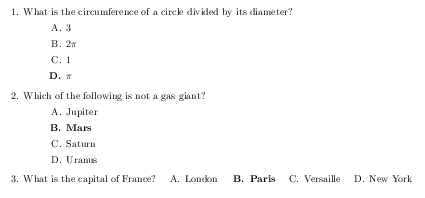
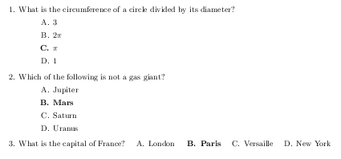
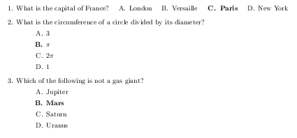

# exam-ifat

To use IFAT (Instant Feedback Assessment Technique) scratch-off scantrons, 
you must match your multiple choice exam to the predetermined key.
This LaTeX package `exam-ifat.sty` allows you to fix the predetermined answer key.
For example, to set the answer key to "D,B,B" write `4,2,2` as below.

    \documentclass[answers]{exam}
    \usepackage{exam-ifat}
    
    %% SET answerkey for given exam here
    \def\answerkey{{{},4,2,2}}
    
    %% SET random seed (optional)
    \PSNuseoldrandom
    \PSNrandseed{21718}
    
    \loadrandomproblems{3}{data}
    
    \begin{document}
    \begin{questions}
    \foreachproblem{\question\thisproblem}
    \end{questions}
    \end{document}

If you change `4,2,2` to `3,2,2`,
notice that the correct answer to Question 1 gets moved to C.

If you change the random seed but keep the `3,2,2`,
the questions get shuffled differently,
but notice that the answer key stays "C,B,B" (which is the point).

This package defines two commands, `\fourMC` and `\fiveMC`.
This package relies on  relies on `pgfmath.sty` to read your answer key `\answerkey`,
and relies on `probsoln.sty` to shuffle the questions.
In order to support shuffling questions,
questions must be stored in a separate file
and then loaded using `\loadrandomproblems`, as above.
If you don't need to shuffle the questions,
you can enter the questions directly into the main tex file, as below.

    \documentclass[answers]{exam}
    \usepackage{exam-ifat}
    
    %% SET answerkey for given exam here
    \def\answerkey{{{},3,2,2}}
    
    \begin{document}
    \begin{questions}
    \question
    What is the capital of France?
    \begin{oneparchoices}
    \fourMC{Paris}{London}{Versaille}{New York}
    \end{oneparchoices}
    
    \question
    What is the circumference of a circle divided by its diameter?
    \begin{choices}
    \fourMC{$\pi$}{3}{$2\pi$}{1}
    \end{choices}
    
    \question
    Which of the following is not a gas giant?
    \begin{choices}
    \fourMC{Mars}{Jupiter}{Saturn}{Uranus}
    \end{choices}
    \end{questions}
    \end{document}
